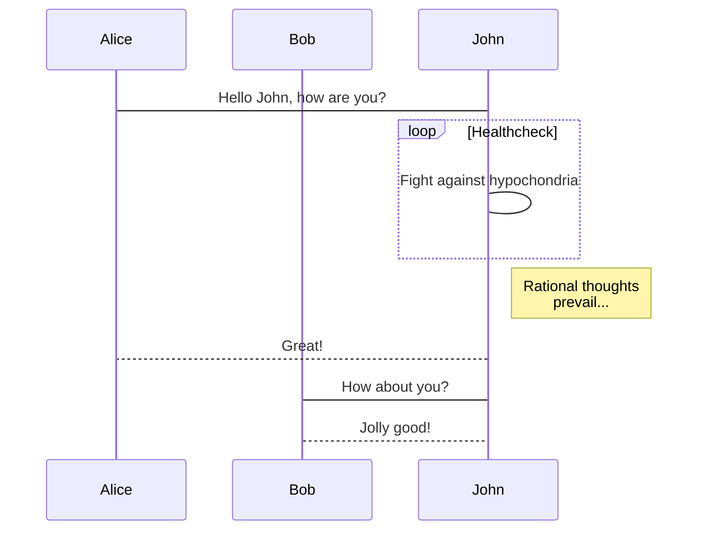
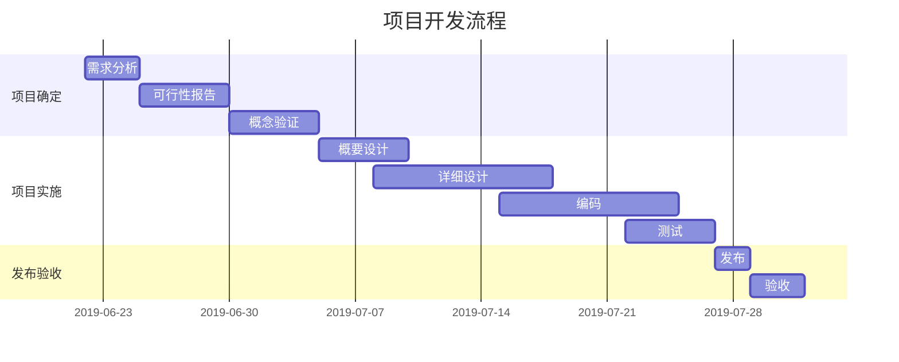

## 在线 Markdown 编辑器
- [HTML 转 Markdown 转换器](https://d1tools.com/tools/convert-html-to-markdown/) | [Markdown 转 HTML 转换器](https://d1tools.com/tools/convert-markdown-to-html/) 
- 地址：[点击前往](https://markdown.buxiantang.top/)。url：`https://markdown.buxiantang.top/`
- 这是我使用[Arya](https://markdown.lovejade.cn/?utm_source=markdown.lovejad------e.cn)开源项目自行部署，这是一款基于 `Vue`、`Vditor`，为未来而构建的在线 Markdown 编辑器；轻量且强大：内置粘贴 HTML 自动转换为 Markdown，支持流程图、甘特图、时序图、任务列表，可导出携带样式的图片、PDF、微信公众号特制的 HTML 等等。
- 我的所有markdown文件都是在这里编写，好的一点是只要不强制刷新或者删除内容，本地内容不会丢失。
## 什么是 Markdown

[Markdown](https://markdown.buxiantang.top/) 是一种方便记忆、书写的纯文本标记语言，用户可以使用这些标记符号，以最小的输入代价，生成极富表现力的文档：譬如您正在阅读的这份文档。它使用简单的符号标记不同的标题，分割不同的段落，**粗体**、*斜体* 或者[超文本链接](https://nav.buxiantang.top/)，更棒的是，它还可以：

---

### 1. 制作待办事宜 `Todo` 列表

- [x] 🎉 通常 `Markdown` 解析器自带的基本功能；
- [x] 🍀 支持**流程图**、**甘特图**、**时序图**、**任务列表**；
- [x] 🏁 支持粘贴 HTML 自动转换为 Markdown；
- [x] 💃🏻 支持插入原生 Emoji、设置常用表情列表；
- [x] 🚑 支持编辑内容保存**本地存储**，防止意外丢失；
- [x] 📝 支持**实时预览**，主窗口大小拖拽，字符计数；
- [x] 🛠 支持常用快捷键(**Tab**)，及代码块添加复制
- [x] ✨ 支持**导出**携带样式的 PDF、PNG、JPEG 等；
- [x] ✨ 升级 Vditor，新增对 `echarts` 图表的支持；
- [x] 👏 支持检查并格式化 Markdown 语法，使其专业；
- [x] 🦑 支持五线谱、及部分站点、视频、音频解析；
- [x] 🌟 增加对**所见即所得**编辑模式的支持(`⌘-⇧-M`)；

<details>
  <summary>点我展开看代码</summary>
  <pre><code>
- [x] 🎉 通常 `Markdown` 解析器自带的基本功能；
- [x] 🍀 支持**流程图**、**甘特图**、**时序图**、**任务列表**；
- [x] 🏁 支持粘贴 HTML 自动转换为 Markdown；
- [x] 💃🏻 支持插入原生 Emoji、设置常用表情列表；
- [x] 🚑 支持编辑内容保存**本地存储**，防止意外丢失；
- [x] 📝 支持**实时预览**，主窗口大小拖拽，字符计数；
- [x] 🛠 支持常用快捷键(**Tab**)，及代码块添加复制
- [x] ✨ 支持**导出**携带样式的 PDF、PNG、JPEG 等；
- [x] ✨ 升级 Vditor，新增对 `echarts` 图表的支持；
- [x] 👏 支持检查并格式化 Markdown 语法，使其专业；
- [x] 🦑 支持五线谱、及部分站点、视频、音频解析；
- [x] 🌟 增加对**所见即所得**编辑模式的支持(`⌘-⇧-M`)；
  </code></pre>
</details>

---

### 2. 书写一个质能守恒公式[^LaTeX]

$$
E=mc^2
$$

---

### 3. 高亮一段代码[^code]

```js
// 给页面里所有的 DOM 元素添加一个 1px 的描边（outline）;
[].forEach.call($$("*"),function(a){
  a.style.outline="1px solid #"+(~~(Math.random()*(1<<24))).toString(16);
})
```

### 4. 高效绘制流程图


### 5. 高效绘制序列图



### 6. 高效绘制甘特图

> **甘特图**内在思想简单。基本是一条线条图，横轴表示时间，纵轴表示活动（项目），线条表示在整个期间上计划和实际的活动完成情况。它直观地表明任务计划在什么时候进行，及实际进展与计划要求的对比。



### 7. 支持图表
> [!TIP]
> 可能在博客内无法正常预览

<details>
  <summary>点我展开看代码</summary>
  <pre><code>
```echarts
{
  "backgroundColor": "#212121",
  "title": {
    "text": "访问来源",
    "subtext": "2019 年 6 月份",
    "x": "center",
    "textStyle": {
      "color": "#f2f2f2"
    }
  },
  "tooltip": {
    "trigger": "item",
    "formatter": "{a} <br/>{b} : {c} ({d}%)"
  },
  "legend": {
    "orient": "vertical",
    "left": "left",
    "data": [
      "搜索引擎",
      "直接访问",
      "推荐",
      "其他",
      "社交平台"
    ],
    "textStyle": {
      "color": "#f2f2f2"
    }
  },
  "series": [
    {
      "name": "访问来源",
      "type": "pie",
      "radius": "55%",
      "center": [
        "50%",
        "60%"
      ],
      "data": [
        {
          "value": 10440,
          "name": "搜索引擎",
          "itemStyle": {
            "color": "#ef4136"
          }
        },
        {
          "value": 4770,
          "name": "直接访问"
        },
        {
          "value": 2430,
          "name": "推荐"
        },
        {
          "value": 342,
          "name": "其他"
        },
        {
          "value": 18,
          "name": "社交平台"
        }
      ],
      "itemStyle": {
        "emphasis": {
          "shadowBlur": 10,
          "shadowOffsetX": 0,
          "shadowColor": "rgba(0, 0, 0, 0.5)"
        }
      }
    }
  ]
}
```
  </code></pre>
</details>


> **备注**：上述 echarts 图表📈，其数据，须使用严格的 **JSON** 格式；您可使用 JSON.stringify(data)，将对象传换从而得标准数据，即可正常使用。

### 8. 绘制表格

| 作品名称        | 在线地址   |  上线日期  |
| :--------  | :-----  | :----:  |
| 导航页 | [https://nav.buxiantang.top/](https://nav.buxiantang.top/) |2024-07|
| 卜仙堂 | [https://buxiantang.top/](https://buxiantang.top/) |2024-05|
| Markerdown | [https://markdown.buxiantang.top/](https://markdown.buxiantang.top/) |2024-07|

### 9. 折叠代码块
```markdown
<details>
  <summary>点我展开看代码</summary>
  <pre><code>
# 在这里写折叠的代码
  </code></pre>
</details>
```
### 10. 更详细语法说明

想要查看更详细的语法说明，可以参考这份 [Markdown 资源列表](https://github.com/nicejade/nice-front-end-tutorial/blob/master/tutorial/markdown-tutorial.md)，涵盖入门至进阶教程，以及资源、平台等信息，能让您对她有更深的认知。

总而言之，不同于其它*所见即所得*的编辑器：你只需使用键盘专注于书写文本内容，就可以生成印刷级的排版格式，省却在键盘和工具栏之间来回切换，调整内容和格式的麻烦。**Markdown 在流畅的书写和印刷级的阅读体验之间找到了平衡。** 目前它已经成为世界上最大的技术分享网站 `GitHub` 和 技术问答网站 `StackOverFlow` 的御用书写格式，而且越发流行，正在在向各行业渗透。

 

这是一个 Markdown 语法测试页面，同时记录个人常用语法。

## Static Badge（微标）
```

```


## 标题
```
# H1
## H2
### H3
#### H4
##### H5
###### H6
```
效果如下:
# H1
## H2
### H3
#### H4
##### H5
###### H6

## 强调
```
今晚一起吃**火锅**吧！
```
今晚一起吃**火锅**吧！

## 删除线
```
今天吃~~自助餐~~吧！
```
今天吃~~自助餐~~吧！

## 列表
有序列表
```
1. 汽车
2. 牛奶
3. 房子
```
1. 汽车
2. 牛奶
3. 房子

无序列表
```
- 足球
- 面包
- 可乐
```
- 足球
- 面包
- 可乐

## 代码高亮
````
```python
import request
import time

time.sleep_ms(1000)
print("Hello World")
```
````
效果如下:
```python
import request
import time

time.sleep_ms(1000)
print("Hello World")
```

## 链接
```
[我的博客](https://linji.org)
```
[我的博客](https://linji.org)

## 图片
```

```
 <br>

## 表格
```
| 左对齐 | 中对齐 | 右对齐 |
|---|:---:|---:|
| 牛奶 | 可乐 | 面包 |
| 饮料 | 早餐 | 吃饭 |
```
| 左对齐 | 中对齐 | 右对齐 |
|---|:---:|---:|
| 牛奶 | 可乐 | 面包 |
| 饮料 | 早餐 | 吃饭 |

大人，时代变了。别手搓了，还是用[表格生成器](https://www.tablesgenerator.com/)吧！

## 水平线
```
---
我在2条水平线中间
***
```
---
我在2条水平线中间
***

## 引用
```
> 落霞与孤鹜齐飞，秋水共长天一色。《滕王阁序》--王勃
```
> 落霞与孤鹜齐飞，秋水共长天一色。《滕王阁序》--王勃

## 对比
````
```diff
+ this text is highlighted in green
- this text is highlighted in red
```
````
```diff
+ this text is highlighted in green
- this text is highlighted in red
```

## 字体颜色
````
```CSS
Some text in green! 123
```
````
```CSS
Some text in green! 123
```

````
```P4
Some text in blue! 123
```
````
```P4
Some text in blue! 123
```

````
```Mint
Some text in blue with additional keyword highlighting! 123
```
````
```Mint
Some text in blue with additional keyword highlighting! 123
```

````
```JSON
Some text highlighted in red! 123
```
````
```JSON
Some text highlighted in red! 123
```

## HTML 语法
等宽字体
```
<samp>Monospaced text</samp>
```
<samp>Monospaced text</samp>

下划线
```
<ins>Underlined text</ins>
```
<ins>Underlined text</ins>

单元格
```
<table><tr><td>Boxed text</td></tr></table>
```
<table><tr><td>Boxed text</td></tr></table>

展开/折叠
````
<details>
<summary>Item summary with dropdown</summary>

Dropdown content (supports **markdown** ~~yay!~~)

```json
{
  awesome: "true"
}
```
</details>
````
效果如下:
<details>
<summary>Item summary with dropdown</summary>

Dropdown content (supports **markdown** ~~yay!~~)

```json
{
  awesome: "true"
}
```
</details>

粗体斜体
```
__*Italic-bold*__
```
__*Italic-bold*__

上标
```
Superscript<sup>TM</sup>
```
Superscript<sup>TM</sup>

斜体上标
```
Superscript-italic<sup>*tm*</sup>
```
Superscript-italic<sup>*tm*</sup>

下标
```
Subscript<sub>x</sub>
```
Subscript<sub>x</sub>

粗体下标
```
Subscript-bold<sub>**min**</sub>
```
Subscript-bold<sub>**min**</sub>

```
~~__*Italic-bold-strikethrough*__~~
```
~~__*Italic-bold-strikethrough*__~~

## 参考
更多GitHub Markdown 语法参考：

1.  https://github.com/Olwiba/Kickass-markdown/
2.  https://docs.github.com/zh/get-started/writing-on-github/getting-started-with-writing-and-formatting-on-github/basic-writing-and-formatting-syntax